# Technical Architecture — Hunch (v4)

This is a complete standalone architecture document for v4. It supersedes the v3 architecture doc and covers all systems as they exist after the v4 branch.

---

## System Overview

```mermaid
graph TB
    subgraph Client["Browser (Next.js App Router)"]
        LP["Landing page /"]
        SP["Start page /start"]
        JP["Join page /join"]
        OP["Organizer page /room/code/organizer"]
        PP["Player page /room/code/player/id"]
        PRP["Present screen /room/code/present"]
    end

    subgraph API["Next.js API Routes (Vercel Serverless)"]
        CR["/api/create-room"]
        JR["/api/join-room"]
        SR["/api/start-round"]
        SA["/api/submit-answer"]
        SG["/api/submit-guess"]
        TR["/api/trigger-reveal"]
        CW["/api/calculate-winner"]
        SK["/api/skip-round"]
        EG["/api/end-game"]
        AQ["/api/add-question"]
        APQ["/api/approve-question"]
        SQ["/api/seed-questions"]
        DQ["/api/delete-question"]
        US["/api/update-session"]
        RP["/api/remove-player"]
        SF["/api/submit-feedback"]
        STATS["/api/stats"]
        SESS["/api/session/code"]
    end

    subgraph OG["Image Generation (Satori + ImageResponse)"]
        BADGE["/api/badge/sessionId/playerId"]
        STORY["/api/session-story/code"]
        EXPORT["/api/export-image/code"]
    end

    subgraph DB["Supabase (PostgreSQL)"]
        subgraph RT["Realtime tables (postgres_changes)"]
            SESS_T[(sessions)]
            PLAY[(players)]
            RND[(rounds)]
            GS[(guesses)]
            TA[(target_answers)]
            SC[(scores)]
        end
        subgraph POLL["Polling only"]
            QS[(questions)]
        end
        FB[(feedback)]
    end

    subgraph Files["Repo — static data"]
        QJ[data/questions.json]
        PJ[data/packs.json]
        FONTS[src/lib/ogFonts.ts]
    end

    SP -->|POST| CR --> SESS_T & PLAY
    JP -->|POST| JR --> PLAY
    OP -->|POST| SR --> RND
    PP -->|POST| SA --> TA
    PP -->|POST| SG --> GS
    OP -->|POST| TR --> RND
    OP -->|POST| CW --> SC & RND
    OP -->|POST| SK --> RND
    OP -->|POST| EG --> SESS_T
    OP -->|POST| AQ --> QS
    OP -->|POST| APQ --> QS
    OP -->|POST| SQ --> QS
    OP -->|POST| DQ --> QS
    OP -->|POST| US --> SESS_T
    OP -->|POST| RP --> PLAY
    PP -->|POST| SF --> FB
    OP -->|POST| SF --> FB
    LP -->|GET cached 5min| STATS

    QJ & PJ -->|wipe + reseed| SQ

    OP -->|Realtime channel| RT
    PP -->|Realtime channel| RT
    PRP -->|Realtime channel| RT

    OP -->|Poll every 5s| QS
    PRP -->|Poll every 5s| QS

    FONTS -->|ArrayBuffer| BADGE & STORY & EXPORT
```



---

## Key Architectural Decisions

| Decision | What | Why |
|---|---|---|
| **Realtime for game state** | sessions, players, rounds, guesses, target_answers, scores | Sub-second sync across all screens. Supabase Realtime delivers `postgres_changes` events without polling overhead. |
| **Polling for questions** | `questions` table polled every 5s | Realtime replication intentionally disabled on this table — 5s lag acceptable for question bank updates. Avoids unnecessary realtime slots. |
| **Serverless API routes** | All mutations go through Next.js API routes | Supabase credentials stay server-side only. No direct DB access from browser. |
| **File-based question management** | `data/questions.json` + `data/packs.json` → seed API | Edit JSON, push, hit `/api/seed-questions`. Wipe-and-reseed on every call. No DB admin access needed. |
| **No user auth** | Players identified by UUID in localStorage | Party game — no login friction. UUID stored as `gtg_player_id`. `player_token` stored for rejoin. |
| **Lazy session cleanup** | On every `create-room`, expire sessions > 24h | Vercel is serverless — no background jobs. Piggybacks on natural usage. |
| **Real fonts for Satori** | `ogFonts.ts` loads Inter as ArrayBuffer | Satori silently ignores `system-ui`/`sans-serif`. Font must be an explicit ArrayBuffer or share cards render blank/white text. |
| **Inline QR — no external service** | `uqr` library renders QR matrix client-side | No external dependency, no privacy leak, works offline. Rendered as 3×3 pixel grid divs. |
| **iOS numeric input pattern** | `type="text" inputMode="numeric" pattern="[0-9]*"` + strip non-digits on change | `type="number"` shows decimal point on iOS numeric keyboard. This pattern gives a clean numpad without decimals or spinners. |
| **touch-action: manipulation on all buttons** | All interactive buttons on `/start` — including `PackPicker` pack-selection buttons — use `style={{ touchAction: 'manipulation' }}` + `cursor-pointer` + no `transition-all`. Disabled button uses `opacity-50` not `pointer-events-none`. | iOS Safari blocked taps on buttons with `transition-all` CSS. `touch-action: manipulation` removes 300ms tap delay and unblocks touch events on both iOS and Android. `pointer-events-none` on the `Create Room` button was also removed — redundant with `disabled` and can interfere with iOS touch routing. |
| **Web Share API for join link** | `navigator.share()` in organizer lobby; clipboard fallback if not supported | Lets organizer share the join URL via WhatsApp, Teams, SMS etc using the OS share sheet. No server-side involvement — purely client-side browser API. |
| **organizer_plays DB flag** | `sessions.organizer_plays boolean DEFAULT false` | Keeps host-as-player opt-in with zero impact on existing sessions. All score queries, badge logic, and SubmissionGrid filter on this flag. |
| **Multi-pack as null pack_id** | 0 or 2+ selected packs → `pack_id = null` (Mixed) | No backend change needed; null already means "draw from all packs". Multi-select is purely a UI concept resolved to a single API value. |
| **Late-join via localStorage flag** | join-room API returns `late_join: true` for active/paused sessions; join page writes `gtg_late_join` to localStorage; player page reads it on mount and shows hang-tight UI | Avoids prop-drilling or URL params. Flag is cleared once the in-progress round reaches `done`. |
| **Game-ended UX on join page** | When join-room API returns 400 with `data.redirect`, join page renders a full-page "game ended" screen instead of an error string | Surfaces a friendly call-to-action (`/start`) rather than a raw error message for the most common late-join failure case. |
| **Auto-question pre-select for round 1** | `buildSuggestedQuestions` now called in the lobby init path (no rounds yet) with `usedIds = new Set()` | Previously only triggered after `done` rounds; organizer had to manually pick the first question. |
| **`preset` passed into `buildSuggestedQuestions`** | Function signature now accepts `preset?: string \| null`; call sites in `init()` pass `sess.preset` directly | `isPartyMode` derives from React state (`session`), which is not yet set when `init()` runs; passing the raw DB value fixes the stale-closure bug that prevented auto-selection on round 1. |
| **`calculatedForRoundRef` guard on auto-reveal** | `useRef<string \| null>` tracks which `round.id` has already triggered `handleCalculateWinner` | Without it, when `currentRound.status` changes to `done` the reveal effect fires again; if no winner (all passed), `winners` stays `[]` and the effect calls `calculate-winner` in an infinite loop. |
| **Session status updated locally on round start** | `handleStartRound` calls `setSession(s => ({...s, status: 'active'}))` on success | Previously session stayed `'lobby'` in local state until realtime fired; the active-round UI is gated on `session.status === 'active'`, so the organizer saw a blank screen until manual refresh. |
| **QR pixel rows use explicit `height: 4` + `flexShrink: 0`** | Row divs use `style={{ display: 'flex', height: 4 }}`, pixel divs use `flexShrink: 0` | Tailwind's `className="flex"` on row divs collapsed pixel heights to 0 on some renderers, producing a blank white QR box. |
| **`uqr.data` is 2D — access as `data[y][x]`** | Changed from `data[y * size + x]` (flat) to `data[y][x]` (2D) in organizer lobby QR renderer | `uqr.encode()` returns `{ data: boolean[][] }` — a 2D array of rows. Flat indexing treated each row-array as truthy, rendering the entire first `size` entries as black and the rest as undefined/white — producing "white QR with one black line." Presentation page already used `data[y][x]` correctly. |
| **`onTouchEnd` + `preventDefault` on iOS-critical buttons** | Quick Start, Custom, and "I'll play too" buttons on `/start` add `onTouchEnd={(e) => { e.preventDefault(); handler() }}` | `touchAction: manipulation` alone is insufficient on some iPhone/iOS Safari versions. `onTouchEnd` + `preventDefault` bypasses iOS's 300ms delay pipeline entirely — the handler fires at touch release and `preventDefault` stops the redundant click from firing. |
| **REVERSED — `onTouchEnd + preventDefault` REMOVED from Quick Start / Custom tabs** (April 2026) | `onClick` alone with `touchAction: 'manipulation'` + `WebkitTapHighlightColor: 'transparent'`. No touch handlers. | The `onTouchEnd + preventDefault` pattern turned out to be the CAUSE of the "buttons untappable on iPhone Safari" bug, not the fix. `preventDefault()` inside `touchend` suppresses the synthesized click event on iOS WebKit, so the `onClick` handler never fires. Modern iOS (15+) doesn't need the 300ms-delay workaround when `touch-action: manipulation` is set. `bugfixBatch7.test.ts` has a dedicated guard: if anyone reintroduces `onTouchEnd` on the preset buttons, the test fails immediately. |
| **ACTUAL ROOT CAUSE — Next.js 16 `allowedDevOrigins` missing from `next.config.ts`** (April 2026) | `allowedDevOrigins: ['*.local', '192.168.*.*', '10.*.*.*', '172.16.*.*' … '172.31.*.*']` added to `next.config.ts`. Next.js requires a **full dev-server restart** (not HMR) to pick this up. | **The recurring "preset buttons don't tap on iPhone" bug was never about button CSS, tap target size, `transition-all`, `cursor-pointer`, `onTouchEnd`, stacked-cards vs tab-bar layout, or any of the React-side hypotheses chased for multiple sessions.** It was Next.js 15.2+ silently rejecting cross-origin dev-mode requests from LAN IPs (`192.168.x.x:3000`). The SSR HTML rendered correctly but **React never hydrated on the client** — `useEffect` never ran, `useState` updates never propagated, no buttons responded, and typing in inputs worked only because browsers handle uncontrolled-input keystrokes natively. Proved decisively with an on-screen debug strip that showed `NATIVE · initializing…` frozen (i.e. `useEffect` never fired) while the input still accepted keystrokes. The bug appeared intermittent because testing via `localhost:3000` worked fine (same origin) and testing via LAN IP did not (cross-origin). Adding `allowedDevOrigins` immediately flipped the diagnostic: `NATIVE · ticks=16` → setInterval alive, `REACT · preset=party` → state updates flowing, `events: btn→party` → `onClick` firing, `NATIVE · clicks=1 · lastTarget=BUTTON` → touches landing on the button. With the config fix in place, the segmented tab-bar UI (from ab869aa) was restored as the preferred visual design. Guarded by `bugfixBatch7.test.ts` — the `192.168.*.*` entry in `next.config.ts` must be present. |
| **`themeColor` moved from `metadata` to `viewport` export** (April 2026) | `export const viewport: Viewport = { themeColor: '#0f172a', width: 'device-width', initialScale: 1 }` in `layout.tsx`. `metadata` export no longer contains `themeColor`. | Next.js 15+ deprecated putting `themeColor` inside the `metadata` export — it must live in a separate `viewport` export. Leaving it in `metadata` under Next 16 emits a dev-mode warning that was contributing to hydration instability during the iPhone preset-tap bug investigation. Moved as part of the `allowedDevOrigins` fix-batch. Guarded by `bugfixBatch7.test.ts`. |
| **Flex-row overflow guards — `min-w-0` + `shrink-0` + `truncate`** (April 2026 pre-party batch) | Every `flex gap-*` row with 2+ children in the organizer page (Reveal/Skip, host-guess input + Submit + Pass) uses `flex-1 min-w-0 truncate` on the growing child and `shrink-0` on the fixed siblings. | Flex children default to `min-width: auto` (= min-content / intrinsic width). With `text-lg font-black` or long labels, this forces a `flex-1` child to stay at its content width, pushing siblings off the viewport. On iPhone 16 Pro (~390px), the "Reveal Answers! 🎭" button was pushing the Skip button off the right edge. The fix is three-part: `min-w-0` lets the growing child actually shrink, `truncate` handles the overflow gracefully, and `shrink-0` guarantees fixed siblings never get squished to 0 width. `bugfixBatch8.test.ts` asserts both patterns are present in the Reveal/Skip and host-guess rows. The general rule is now enforced by a count-based guard: the organizer page must have ≥2 `flex-1 min-w-0` usages and ≥3 `shrink-0 px-` usages. |
| **`trigger-reveal` idempotency guard** (April 2026 pre-party batch) | `api/trigger-reveal/route.ts` now selects `rounds.status` and returns the existing round early if it's already `'reveal'` or `'done'`, skipping the auto-pass insert loop. | Double-tapping Reveal on a spotty connection sent two concurrent requests, both of which read `existingGuesses = []`, both inserted auto-pass rows for missing guessers, and the reveal animation showed duplicate "Didn't answer" cards. The idempotency check makes the API safe against re-entry at the HTTP level — no need for client-side debouncing. Guarded by `bugfixBatch8.test.ts`. |
| **Join form double-tap re-entry guard** (April 2026 pre-party batch) | `src/app/join/page.tsx` declares a `submitInFlightRef` (via `useRef<boolean>`) that flips true synchronously at the top of `handleSubmit` and guards re-entry. | `disabled={loading}` on the submit button isn't enough on iOS Safari — React state updates from `setLoading(true)` happen after the current event loop tick, so a double-tap within ~50ms can fire `handleSubmit` twice before the re-render disables the button. The first request succeeds; the second returns a `409 name already taken` error because the first just joined. The `ref` pattern flips synchronously, blocking the second call at the very top of the handler. Guarded by `bugfixBatch8.test.ts`. |
| **`calculate-winner` inserts scores BEFORE flipping round status to `done`** (April 2026 pre-party batch) | `api/calculate-winner/route.ts` reordered: score inserts happen first, round status update happens second. | Previously, the round was marked `done` first, which fired a Supabase Realtime event for the `rounds` table. Clients refreshing on that event would read the `scores` table before the inserts had committed, getting a partial leaderboard. Already mitigated by an earlier fix that reconstructs winners from `guesses` (source of truth) rather than `scores`, but this reorder is defence-in-depth to prevent the remaining leaderboard flicker. Guarded by `bugfixBatch8.test.ts` — the score insert index in the source file must appear before the `status: 'done'` update index. |
| **`WinnerReveal` `onDoneRef` pattern** (April 2026 pre-party batch) | `WinnerReveal.tsx` captures `onDone` into a ref synced via a second `useEffect`. The main effect's scheduled timeouts call `onDoneRef.current()` instead of the closed-over `onDone`. | Latent stale-closure bug: the previous implementation had `// eslint-disable-next-line react-hooks/exhaustive-deps` with `[visible]` deps, capturing `onDone` at the time the effect first fired. If `onDone` changed during the 4.5-second reveal animation (e.g., parent re-renders with a new callback), the scheduled timeout would fire the OLD callback. Not triggered by the current callers because all onDone handlers are semantically equivalent, but a latent trap for any future refactor. The ref pattern is the standard React idiom for "always call the latest version of this callback." Guarded by `bugfixBatch8.test.ts` — the `onDoneRef` declaration + sync + call must all be present, and the eslint-disable comment must be gone from the effect. |
| **`navigator.share` `AbortError` check** (April 2026 pre-party batch) | The organizer share-link button's catch block around `navigator.share` now checks `(err as Error)?.name === 'AbortError'` and returns early, preventing the fallback cascade. | Previously, if the user opened the iOS share sheet and dismissed it, `navigator.share` threw an `AbortError`, the empty `catch {}` ignored it, and the code fell through to the clipboard path — eventually showing the `window.prompt()` fallback even though the user deliberately cancelled. Now: user cancellation stops the flow, real errors still fall through to clipboard. Guarded by `bugfixBatch8.test.ts`. |
| **3-way exact-match tie scoring invariant** (April 2026 pre-party batch) | `bugfixBatch8.test.ts` adds pure-logic tests for 3+ players all exact-matching the target: simple mode gives 1 pt each, rich mode gives 3 pts each, and a 4-player mixed case (3 exact + 1 off-by-5) gives 3/3/3/2 pts correctly. | The scoring code already handled this correctly, but no existing test covered 3+ tied exact matches. At a real party a 3-way exact match is uncommon but plausible (everyone knows the target well), and getting scores wrong on the most exciting round of the game would be a show-stopper. |
| **Round 1 auto-target for all modes** | `init()` now auto-selects a random non-organizer player as target when no rounds exist, for both party AND custom mode | Previously only party mode had auto-target via `rotationQueueRef`. Custom mode required host to manually pick every time, including round 1. |
| **Organizer confetti gated on being a winner** | `handleCalculateWinner` only calls `setShowConfetti(true)` if `session.organizer_plays && organizerPlayerId is in allWinners` | Previously confetti fired on the organizer screen for every round result, regardless of whether the host won. |
| **Winner badges hidden until all cards revealed** | `winnerIds` prop passed to `RevealCard` as `allRevealed ? winners.map(w=>w.id) : []` on both organizer and player pages | `winners` state gets populated by `handleCalculateWinner` / `refreshAll` which can fire mid-reveal. Without the gate, the first card that matched a winner showed a "🏆 Winner" badge before the target card was even revealed. |
| **Player confetti uses per-round-id dedup ref** | `confettiFiredForRoundRef` replaces the `prevRoundStatusRef !== 'done'` gate | Status-transition guard fired exactly once — if scores hadn't landed yet (tie race condition), confetti never fired for tied winners. Per-round-id ref keeps the check window open on every poll until `myRoundScore.points > 0` is confirmed. |
| **`sessions.paused_at` stores server-side pause timestamp** | Pause API writes `paused_at = NOW()` to sessions; resume API reads it back. Client no longer tracks `pausedAtRef`. Server auto-queries the active `guessing` round for `started_at` offset. | Client-side `pausedAtRef` was lost on organizer page refresh — any refresh between pause and resume meant `started_at` was never shifted, so the timer raced to 0 for all clients on resume. |
| **Timer resume buffer widened to 6s + client `paused_at` fallback** | `RESUME_BUFFER_MS = 6000` in `Timer.tsx`. Organizer client also stamps `session.paused_at = new Date().toISOString()` into local state on pause, and sends that value in the resume request body so the server can still shift `started_at` if its own `sessions.paused_at` read returns null/stale. | The original 2.5s buffer wasn't enough under slow Realtime propagation or a brief network hitch — `Timer.tsx` would drop to the drifted value (e.g., "paused at 32s → resumed at 25s") before `rounds.started_at` arrived on the client. Two belt-and-suspenders mitigations: a longer buffer gives the server write more time to propagate, and a client-echoed `paused_at` gives the resume API a reliable fallback when its own DB read is stale. Regression-tested by `bugfixBatch7.test.ts`. |
| **QuestionBank pack filter tab** | `QuestionBank` gains a `sessionPackId` prop and a "This Pack / All" tab bar. Default tab is "This Pack". `allMainApproved.filter(q => q.pack_id === sessionPackId)` filters the list. | Without filtering, a host who selected a Bollywood pack still saw all 200+ questions from every pack mixed together, defeating the purpose of pack selection. |
| **`PlayerBadge.rank`, `totalPlayers`, `bestDistance`** | Badge API route computes rank (sort by total score), totalPlayers, and bestDistance (min absolute distance across non-passed guesses). `BadgeCard` shows "#2 of 5" and "Best: off by 3" pills. Same computation runs on the player page for the in-game BadgeCard. | Badge was previously only an archetype name + copy. Adding rank and closest moment makes it specific, personal, and worth sharing. |
| **`loadRegularFont` tries multiple paths** | `ogFonts.ts` iterates two known Geist TTF paths before falling back to CDN fetch | On certain Next.js versions or local dev environments, the bundled font path doesn't exist. Single `readFileSync` without fallback caused the entire image route to throw and Chrome showed a white page with no useful error. |
| **Image routes wrapped in try/catch** | `session-story/[code]` and `export-image/[code]` now catch all render errors and return a `500 text/plain` response | Without error handling, any font/data issue caused an unhandled exception — Chrome rendered nothing. Now the error message is shown as plain text for debugging. |
| **Organizer badge share matches player share** | `GameOverOrganizer` badge button uses Web Share API (share PNG file) with download fallback, not a plain `<a>` link | Consistent UX: player badge in `BadgeCard.tsx` uses `navigator.share({ files: [blob] })`; organizer previously had a bare `<a target="_blank">` that opened the image in a new tab. Now both paths use the same share-or-download pattern. |
| **Loading state kept `true` after navigation** | `join/page.tsx` and `start/page.tsx` use a `navigated` flag; `finally { if (!navigated) setLoading(false) }` — on the success path, loading stays `true` until the component unmounts | `finally` always runs after `router.push()`. Without the guard, the loading state reset for ~200ms before Next.js completed page transition — producing a visible button re-activation flash on both organizer create and player join flows. |
| **Target auto-select during lobby poll** | The 3s lobby poll in `organizer/page.tsx` calls `setTargetPlayerId` with a functional updater: `(current) => current || pickRandom(nonOrg)` | `init()` auto-selects when it runs, but players often join *after* init — at that point `nonOrg` is empty. Without re-running auto-select in the poll, the target remained unset even after players joined, and the host had to manually tap a player before starting round 1. |
| **Player confetti gated on top score, not any score** | `confettiFiredForRoundRef` now gates on `myScore.points === maxScore.points` (fetched in parallel) instead of `myScore.points > 0` | In Rich mode (3/2/1 pts), 2nd and 3rd-place players earn points and previously all got confetti. Only the highest-score earner(s) in the round should celebrate. Parallel fetch of `topScore` adds one extra DB call per round-end event on the player page. |
| **Scroll to top on game end (all screens)** | `useEffect(() => { if (session?.status === 'ended') window.scrollTo(...) }, [session?.status])` added to both organizer and player pages | Organizer already scrolled to top on round start (`handleStartRound`). Game end had no equivalent — players who had scrolled into the reveal phase saw a mid-page game-over view. |
| **Host included in player leaderboard** | Player page `loadScores` uses `organizerPlaysRef.current` (synced from session state) instead of hard-filtering `!p.is_organizer` | The organizer page's `loadScores` already accepted an `organizerPlays` param. The player page's version always excluded the organizer even when `organizer_plays = true`, so the host was invisible on the game-over leaderboard for players. |
| **`uqr.data[y][x]` in export-image route** | Changed from flat `data[y * qr.size + x]` to 2D `data[y][x]` in `/api/export-image/[code]/route.tsx` | Same 2D array bug as the organizer lobby. The session card's QR box rendered entirely white. Organizer lobby and session-story already used correct 2D access. |
| **Badge PNG attribution** | Footer on badge PNG updated to include "Built by Dheeraj Jain" as a third segment alongside room code + site URL | Attribution was missing from the shareable badge image. The session card already had the attribution in its footer. |
| **`"Suggest a question"` hidden on game over** | Conditional `{session?.status !== 'ended' && <div ...>}` wraps the player-side question submission widget | The widget appeared on the game-over screen even though the session was ended and adding questions was pointless. The organizer game-over screen already had no question bank. |
| **Pause freezes the reveal animation** | The auto-reveal `useEffect` in `organizer/page.tsx` now bails early when `session?.status === 'paused'`, and depends on `session?.status` so it re-runs cleanly on resume. The pending `setTimeout` is torn down by the cleanup. | Before this fix, hitting pause during reveal did nothing visible — cards kept flipping one by one and `calculate-winner` eventually fired, so from the host's perspective "pause did not work." Session-level pause state must now dominate every auto-advance loop, not just the timer. |
| **Host reveal sound** | Organizer page now imports `soundCardReveal` and calls it inside the auto-reveal timeout (same place as the player page). Host audio is explicitly **unlocked** via a new `unlockSound()` helper on `handleStartRound` click, on sound-toggle-on, **and on both `handleTriggerReveal` / `handleForceReveal` clicks** — all are user gestures that satisfy Web Audio's autoplay policy. The reveal-button unlock prevents browser AudioContext re-suspension between round start and reveal (minutes can pass). | Before: organizer page only imported `soundWinner + soundCrowd` and never played the card-reveal "pop". Also, if the host never clicked anything that pre-warmed the `AudioContext`, `play()` calls from inside a `setTimeout` were silently rejected by Chrome/Safari's autoplay policy. |
| **`buildSuggestedQuestions` accepts `autoSelect` flag** | New boolean parameter (default `true`). The "✕ Change question" onClick passes `false`. | Per DECISIONS-v3 R-9 the Change-question link should *deselect and show suggestions*, not immediately re-pick one. The old implementation re-ran the builder after setting `selectedQuestion = null`, and the builder unconditionally called `setSelectedQuestion(top3[0])` — so the change button visually did nothing. |
| **`guesses.auto_passed` boolean** | New column (default `false`) added in migration `v4-noanswer.sql`. Populated by `/api/trigger-reveal` for every eligible guesser who never submitted a row. Scoring still treats `passed = true` as 0 points, but the reveal UI renders "Didn't answer" when `auto_passed = true`, and the Devdas badge (3+ passes) ignores auto-passes. | Unanswered players previously had **no row at all** in `guesses`. They were silently 0-pointed but the host couldn't tell AFK players from explicit passers, and the reveal animation had no card for them. Creating the rows upstream (in `trigger-reveal`, not `calculate-winner`) guarantees the reveal animation can render a card for them. |
| **Host badge computed on game end for share modal** | `organizer/page.tsx` now imports `assignBadges` and runs the same badge computation the player page does, gated on `session.status === 'ended' && organizer_plays`, and hands the result to `GameOverOrganizer` as the `hostBadge` prop. | The viral `shareCopy.ts` templates key off the badge name. Without the host's badge metadata on the organizer side, the "Share your badge" button fell back to generic text. |
| **Reveal card `autoPassed` field** | `RevealCardData` gained `autoPassed?: boolean`; `RevealCard.tsx` renders "Didn't answer" instead of "Passed" when set. All three `buildRevealCards` implementations (organizer, player, present) pass the flag through. | See above — the UI distinction requires plumbing the flag from the guess row into the card type. |
| **NumberLine clusters duplicate answers** | `NumberLine.tsx` rewritten to group points by exact answer value into clusters. Each cluster renders a single dot on the track and a fanned horizontal stack of 26×26 avatar circles (player initials + deterministic hue from name) with `-10px` overlap. Target and winner avatars get special backgrounds/emoji. More than 3 in a cluster collapses into a `+N` chip. | The old "alternating above/below" label strategy overflowed horizontally when 2+ players submitted the same number — names and values overlapped into unreadable mush. Avatar clustering is the Instagram/WhatsApp pattern and handles any crowd size cleanly. |
| **`ShareArtifactModal` + `shareCopy.ts`** | New reusable component `src/components/ShareArtifactModal.tsx` and helper `src/lib/shareCopy.ts`. The modal shows the artifact image at full size, the viral caption underneath, and three explicit actions (Share / Download / Copy caption). It feature-detects `navigator.share` and gracefully handles `AbortError`. Every badge gets a templated per-badge viral hook that includes player name + rank + best distance + challenge link. Filenames follow `Hunch-<Kind>-<Person>-<Detail>.png`. | The old flow (immediate `navigator.share` → silent download fallback) was broken on iOS Safari and confusing on desktop. Preview-first matches the Instagram/Twitter share mental model, handles both platforms identically, and lets the user actually see what they're about to share. The caption-copy button also makes the share text usable from apps without image-sharing support. |
| **`organizer/page.tsx` round header label** | Changed from `Round {n} Question` to `Round {n}` so it matches the player screen header exactly. | Host and player screens were inconsistent — per original design the two cards should be identical except for the hot/cold toggle. |
| **Quick Start simplified** | Removed "I'll play too" toggle and fixed-setting badges (60s/Rich/Reasoning/Hot-cold) from Quick Start panel. `organizer_plays` forced to `true` in `handleCreate` when `preset === 'party'`. Only pack picker remains. | User feedback: Quick Start was "cryptic" — showing non-interactive settings created cognitive load. The host who wants control uses Custom; Quick Start should be pick-pack-and-go. |
| **Default pack: Office — Safe** | `start/page.tsx` pack selection effect now falls through to `packs.find(p => p.energy_type === 'office_safe')` when no deep-link and no localStorage history. localStorage last-used still overrides. | No default meant first-time users saw "All Mixed" which is chaotic for office/team contexts. Office-safe is the safest first impression. |
| **Sample Qs behind dev flag** | `onSeed` prop only passed to `QuestionBank` when `process.env.NEXT_PUBLIC_DEV_MODE === 'true'`. QuestionBank already conditionally renders `{onSeed && (...)}`. | The seed endpoint wipes and re-inserts all preloaded questions — dangerous on production. Dev-only visibility preserves the workflow without exposing it to real users. |
| **0-guesser lobby guard** | Organizer lobby UI now computes `noGuessers = nonOrgCount <= 1 && !session?.organizer_plays`. When true: amber warning banner + Start button disabled. | With 1 non-org player as target and host not playing, there are literally 0 guessers — the game is broken. Previously no validation prevented starting this unplayable state. |
| **Selected-question card readability** | All three selected-question card instances (lobby, party-mode next-round, custom next-round) changed from `bg-purple-900/30` to `bg-purple-900/60` and text from `text-purple-200` to `text-purple-100`. | At 30% opacity the dark background bled through, making purple text hard to read — especially in the next-round editor which sits over reveal cards. 60% gives a solid-enough background for legibility. |
| **Brand wordmark in game headers** | Organizer and player page headers now show "Hunch" wordmark (`text-sm font-black`) above the room code, replacing the "Room Code" label. Logo bumped 32→36px. Player lobby adds a 48px logo + `text-3xl` wordmark above the waiting message. | Brand recall requires the name "Hunch" to appear everywhere a player looks — not just the homepage. The lobby screen is prime real estate because players stare at it while waiting. |
| **How it Works: animated scenes** | Numbered circles (1/2/3) removed — flow is self-explanatory. TARGET badge moved from card 1 to card 2 (where target actually appears). Rich CSS animations added in `globals.css` (`hiw-*` keyframes): staggered card slide-up entrance, guess-bubble scale-bounce pop-in, purple/rose/amber glow pulses, trophy bounce, winner shimmer, arrow fade-pulse. All pure CSS — no JS animation libraries. | User feedback: (a) TARGET belongs on the guess scene, not the question scene, (b) numbers were redundant, (c) static scenes needed "wow" factor to catch attention on landing page. |

---

## Database Schema

### sessions
| Column | Type | Notes |
|---|---|---|
| id | uuid | PK |
| room_code | text | Unique, 6-char alphanumeric (no I/O/1/0) |
| organizer_player_id | uuid | FK → players.id |
| status | text | `lobby` / `active` / `paused` / `ended` / `expired` |
| paused_at | timestamptz | nullable — set when status → paused, cleared on resume (v4-timer migration) |
| scoring_mode | text | `simple` / `rich` |
| reveal_mode | text | `organizer` / `self` |
| show_reasoning | boolean | |
| hot_cold_enabled | boolean | |
| timer_seconds | integer | 15–180 |
| pack_id | text | nullable — null = mixed |
| acquisition_source | text | `direct` / query param value |
| **organizer_plays** | **boolean** | **DEFAULT false — v4 addition** |
| created_at | timestamptz | |

### players
| Column | Type | Notes |
|---|---|---|
| id | uuid | PK |
| session_id | uuid | FK → sessions.id |
| name | text | Title-cased |
| is_organizer | boolean | |
| player_token | text | UUID stored in localStorage for rejoin |
| colour_index | integer | 0–9 |
| joined_at | timestamptz | |
| is_removed | boolean | |

### rounds
| Column | Type | Notes |
|---|---|---|
| id | uuid | PK |
| session_id | uuid | FK |
| round_number | integer | |
| question_text | text | |
| target_player_id | uuid | FK → players.id |
| status | text | `guessing` / `reveal` / `done` |
| winner_player_id | uuid | nullable |
| pack_id | text | nullable |
| created_at | timestamptz | |

### guesses
| Column | Type | Notes |
|---|---|---|
| id | uuid | PK |
| round_id | uuid | FK |
| player_id | uuid | FK |
| value | integer | nullable (null = pass) |
| reasoning | text | nullable |
| passed | boolean | `true` for an explicit pass OR an auto-pass |
| **auto_passed** | **boolean** | **DEFAULT false — v4-noanswer migration. `true` means the player never submitted anything and the system auto-inserted this row at reveal time. Used to render "Didn't answer" distinctly from "Passed" in the UI, and to exclude from Devdas badge qualification.** |
| submitted_at | timestamptz | Used for speed calculations |

### target_answers
| Column | Type | Notes |
|---|---|---|
| id | uuid | PK |
| round_id | uuid | FK |
| player_id | uuid | FK (must equal round.target_player_id) |
| value | integer | |
| submitted_at | timestamptz | |

### scores
| Column | Type | Notes |
|---|---|---|
| id | uuid | PK |
| round_id | uuid | FK |
| session_id | uuid | FK |
| player_id | uuid | FK |
| points | integer | |
| rank | integer | 1 = closest |

### questions
| Column | Type | Notes |
|---|---|---|
| id | uuid | PK |
| session_id | uuid | nullable — null = pre-loaded |
| text | text | |
| energy_type | text | pack identifier |
| category | text | `habits` / `social` / `work` / `fun` |
| is_preloaded | boolean | Pre-loaded = no delete button in UI |
| status | text | `pending` / `approved` |
| created_at | timestamptz | |

### feedback
| Column | Type | Notes |
|---|---|---|
| id | uuid | PK |
| room_code | text | Linked to room, not player |
| rating | integer | 1–4 (😭 😐 😊 🤩) |
| comment | text | nullable |
| anonymous | boolean | |
| created_at | timestamptz | |

---

## API Route Catalogue

| Route | Method | Auth check | Description |
|---|---|---|---|
| `/api/create-room` | POST | — | Creates session + organizer player. Accepts `organizer_plays`. Lazy-expires sessions > 24h. |
| `/api/join-room` | POST | — | Creates player. Enforces 12-player limit, unique name, active session. Returns `player_token`. |
| `/api/start-round` | POST | organizer | Inserts round row. Validates question + target. |
| `/api/submit-answer` | POST | target only | Inserts target_answer. Blocked if caller is not target. |
| `/api/submit-guess` | POST | non-target | Inserts guess (or pass). Blocked if caller is target. |
| `/api/trigger-reveal` | POST | organizer | Sets round.status = `reveal`. |
| `/api/calculate-winner` | POST | organizer | Scores guesses, inserts scores rows, sets winner. |
| `/api/skip-round` | POST | organizer | Sets round.status = `done`, no winner. |
| `/api/end-game` | POST | organizer | Sets session.status = `ended`. |
| `/api/update-session` | POST | organizer | Updates session fields (pause/resume, hot_cold toggle). |
| `/api/remove-player` | POST | organizer | Sets player.is_removed = true. |
| `/api/add-question` | POST | any player | Inserts pending question for session. |
| `/api/approve-question` | POST | organizer | Sets question.status = `approved`. |
| `/api/seed-questions` | POST | — | Wipes pre-loaded questions, reseeds from JSON files. |
| `/api/delete-question` | POST | organizer | Deletes non-preloaded question. |
| `/api/submit-feedback` | POST | — | Inserts feedback row. |
| `/api/session/[code]` | GET | — | Returns session + players snapshot for a room code. |
| `/api/packs` | GET | — | Returns all packs from `data/packs.json`. |
| `/api/stats` | GET | — | Returns `{ games, players, rounds }` with 5-min cache (`revalidate = 300`). |
| `/api/badge/[sessionId]/[playerId]` | GET | — | Returns 1080×1080 PNG badge image via Satori/ImageResponse. |
| `/api/session-story/[code]` | GET | — | Returns 1200×630 PNG session story image. |
| `/api/export-image/[code]` | GET | — | Returns 1200×630 PNG challenge share card. |

---

## Realtime Architecture

All game clients (organizer, player, present) subscribe to a single Supabase Realtime channel filtered by `session_id`:

```
channel: `room:${session.id}`
event: postgres_changes
tables: sessions, players, rounds, guesses, target_answers, scores
```

**On any change:** Client re-fetches the relevant data via REST (not parsing the change payload directly). This keeps client state consistent even if a realtime event is missed.

**Tables NOT on realtime:** `questions`, `feedback` — these use polling (questions: every 5s) or fire-and-forget (feedback).

**After session ends:** Supabase channel is unsubscribed. No further events processed.

---

## Data Flow — Typical Round

```
Organizer clicks "Start Round"
  → POST /api/start-round
  → Inserts round row (status = guessing)
  → Realtime fires on rounds table
  → All clients fetch round, render guessing phase

Players type a number and submit
  → POST /api/submit-guess
  → Inserts guess row
  → Realtime fires on guesses table
  → Organizer SubmissionGrid checks off that player

Target submits their answer
  → POST /api/submit-answer
  → Inserts target_answers row
  → Realtime fires on target_answers table
  → Organizer "Reveal Answers!" button enables

Organizer clicks "Reveal Answers!"
  → POST /api/trigger-reveal
  → Updates round.status = reveal
  → Realtime fires on rounds table
  → All clients start adaptive card animation sequence

After all cards revealed (auto-triggered client-side)
  → POST /api/calculate-winner
  → Scores guesses, inserts scores rows, sets winner_player_id on round
  → Realtime fires on scores + rounds tables
  → Leaderboard updates, winner banner appears on all screens
```

---

## Image Generation (OG / Share Cards)

All three image endpoints use **Satori** (via Next.js `ImageResponse`) to render JSX → PNG server-side.

### Font Loading (`src/lib/ogFonts.ts`)

Satori ignores `system-ui` and `sans-serif`. Real font data is required.

**Module-level cache** (persists across warm invocations on Vercel):
```ts
let _regular: ArrayBuffer | null = null
let _bold: ArrayBuffer | null = null
```

- **Regular (400):** Reads `Geist-Regular.ttf` from `node_modules/next/dist/compiled/@vercel/og/` — always present in Next.js deploys
- **Bold (700):** Fetches Inter Bold from Google Fonts CSS → extracts woff2 URL → fetches font binary

`loadOgFonts()` returns `[{name:'Inter', data:regular, weight:400}, {name:'Inter', data:bold, weight:700}]` and is called at the top of each image route.

### Badge Card (`/api/badge/[sessionId]/[playerId]`)

- 1080×1080px
- Computes badge server-side using `computeBadge()` from `src/lib/badgeLogic.ts`
- Includes organizer in `nonOrgPlayers` when `session.organizer_plays = true`
- Design: ambient glows, frosted inner card, player name above badge title, emoji drop-shadow, gradient dividers

### Session Story (`/api/session-story/[code]`)

- 1200×630px landscape
- Winner, leaderboard, chaos score, highlights
- Designed for WhatsApp inline preview

### Challenge Share Card (`/api/export-image/[code]`)

- 1200×630px landscape
- "Can your group beat this?" framing
- Includes QR code + pack name

---

## Badge Logic (`src/lib/badgeLogic.ts`)

### Computed Stats Per Player

```ts
interface PlayerStats {
  playerId: string
  roundsAsGuesser: number
  roundsAsTarget: number
  exactGuesses: number           // distance = 0
  avgDistance: number            // accuracy proxy (lower = better)
  avgSubmissionTime: number      // ms from round start (lower = faster)
  consecutiveWins: number        // max consecutive 1st-place finishes
  roundsWon: number              // total 1st-place finishes
  winsWithoutBeingFastest: number
  closestGuesserRatio: number    // fraction of guesser rounds where player was 1st
  isFastestConsistently: boolean // top 3 avg submission time
  targetSpread: number           // max(guesses) - min(guesses) as target
  avgSubmittedNumber: number     // avg value submitted as guesser
  avgSubmissionRank: number      // relative speed rank
  passCount: number
}
```

### Badge Priority (greedy, exclusive)

Badges are assigned in priority order. Once a badge is assigned to a player, that badge is unavailable to others.

```
Baba Vanga → Virat Kohli → Salman Khan → Aamir Khan → MS Dhoni →
Mogambo → SRK → Arnab Goswami → Ambani → Hardik Pandya →
Gabbar Singh → Devdas → Babu Bhaiya
```

Key condition notes:
- **MS Dhoni:** `closestGuesserRatio > 0.5 && !isFastestConsistently` — fastest player gets Hardik Pandya instead
- **Hardik Pandya:** `isFastestConsistently && accuracy in top half` — speed with acceptable accuracy
- **Arnab Goswami:** fastest AND worst accuracy — both required
- **Aamir Khan:** best accuracy AND slowest — both required

### `computeBadge(stats, allPlayersStats)` vs `qualifiesFor(badge, stats, allPlayersStats)`

Both functions use identical conditions. `qualifiesFor` is used in tests to validate individual badge eligibility. `computeBadge` walks the priority list and returns the first badge where the player qualifies and the badge hasn't been taken.

---

## Client-Side Libraries

| Library | Purpose | Used in |
|---|---|---|
| `uqr` | QR matrix generation (no canvas, no external) | Organizer lobby, present screen |
| `satori` / `ImageResponse` | Server-side JSX → PNG | Badge, story, export image routes |
| `canvas-confetti` | Confetti animation | Winner reveal on player + organizer |
| `next/font` | Plus Jakarta Sans (body font) | `layout.tsx` |

---

## LocalStorage Keys

| Key | Value | Set by |
|---|---|---|
| `gtg_name` | Player/organizer name | Join + start pages |
| `gtg_player_id` | UUID | Join-room API response |
| `gtg_session_id` | UUID | Create-room API response |
| `gtg_player_token` | UUID | Join/create API response — used for rejoin |
| `gtg_last_pack_id` | energy_type string | Start page — pre-selects last used pack |
| `gtg_sound_enabled` | `"true"` / `"false"` | Sound toggle in header |

---

## Environment Variables

| Variable | Where used | Notes |
|---|---|---|
| `NEXT_PUBLIC_SUPABASE_URL` | Client + server | Public — safe to expose |
| `NEXT_PUBLIC_SUPABASE_ANON_KEY` | Client + server | Public anon key — RLS enforced |
| `SUPABASE_SERVICE_ROLE_KEY` | Server only (API routes) | Never exposed to client |
| `NEXT_PUBLIC_SHOW_STATS` | Landing page | `"true"` enables social proof strip |

---

## Deployment

- **Platform:** Vercel (serverless)
- **Build:** `next build` — App Router, no custom server
- **DB:** Supabase hosted PostgreSQL + Realtime
- **Fonts:** Geist bundled in Next.js; Inter fetched from Google Fonts at cold start (cached in module scope)
- **Static assets:** `/public/sounds/` — winner fanfare + crowd cheer MP3s

### v4 DB Migration

Run in Supabase SQL Editor before first v4 deploy:

```sql
ALTER TABLE sessions
  ADD COLUMN IF NOT EXISTS organizer_plays boolean NOT NULL DEFAULT false;
```

See `KEY_DOCUMENTS/migrations/v4.sql`.

### Question Seeding

After deploy, hit `POST /api/seed-questions` once to push 90 questions + 6 packs to DB.
Questions source: `data/questions.json` (90 questions, 15 per pack).
Packs source: `data/packs.json` (6 packs including new office_safe + office_unfiltered).

---

## File Structure (key files)

```
src/
  app/
    page.tsx                        # Landing page — social proof, bubbles, CTAs
    layout.tsx                      # OG metadata, theme colour, font
    icon.svg                        # 32×32 favicon (H-mark)
    start/page.tsx                  # Host setup — Quick Start / Custom, pack picker, organizer_plays
    join/page.tsx                   # Player join form
    room/[code]/
      organizer/page.tsx            # Full organizer screen
      player/[playerId]/page.tsx    # Player screen
      present/page.tsx              # TV/projector display
    api/
      create-room/route.ts
      join-room/route.ts
      start-round/route.ts
      submit-answer/route.ts
      submit-guess/route.ts
      trigger-reveal/route.ts
      calculate-winner/route.ts
      skip-round/route.ts
      end-game/route.ts
      update-session/route.ts
      remove-player/route.ts
      add-question/route.ts
      approve-question/route.ts
      seed-questions/route.ts
      delete-question/route.ts
      submit-feedback/route.ts
      session/[code]/route.ts
      packs/route.ts
      stats/route.ts                # Social proof counts, revalidate=300
      badge/[sessionId]/[playerId]/route.tsx
      session-story/[code]/route.tsx
      export-image/[code]/route.tsx
  components/
    HunchLogo.tsx                   # SVG H-mark component, size prop
    SubmissionGrid.tsx              # organizerPlays prop — filters organizer when false
    GameOverOrganizer.tsx           # organizerPlayerId + organizerPlays props
  lib/
    badgeLogic.ts                   # All 13 badges, priority list, computeBadge()
    ogFonts.ts                      # Inter font loader with module-level cache
    supabase.ts                     # Supabase client (anon) + service role
    utils.ts                        # generateRoomCode, toTitleCase, chaos score helpers
  tests/
    badgeLogic.test.ts              # 13 badge scenarios
    utils.test.ts                   # Utility + badge edge cases
data/
  questions.json                    # 90 questions, 15 per pack, 6 packs
  packs.json                        # 6 pack definitions
KEY_DOCUMENTS/
  FEATURE-SPEC-v4.md
  ARCHITECTURE-v4.md
  migrations/
    v4.sql
```

---

## April 2026 bug-batch fixes — architectural notes

A single batch of 12 issues was reported after end-to-end testing on iPhone Safari + Mac Chrome. Fixes are grouped here with their architectural implications so the "why" survives future rewrites.

### Landing page viewport fit (Issue 1)
- `src/app/page.tsx` main element now uses `min-h-dvh` (dynamic viewport height) instead of `min-h-screen`. iOS Safari's `100vh` includes the URL bar, which pushed the `Built by Dheeraj Jain` attribution below the fold.
- Mobile spacing tightened via `md:` breakpoints: `p-4 md:p-6`, `mb-3 md:mb-6` on brand, `text-lg md:text-xl` on tagline (demoted below the larger brand), `py-4 md:py-5` on CTAs, `mb-3 md:mb-4` on how-it-works. Brand is now 64px logo + `text-4xl md:text-5xl` for recall priority.
- **"How it Works" redesigned** as 3 visual scene cards (CSS-illustrated question card, guess bubbles, reveal mini-scene) connected by ↓ arrows. HowToPlay modal synced to same 3-step text (badge step removed).
- Social proof strip hidden below `sm` breakpoint (`hidden sm:flex`) — it's social-proof nice-to-have, and on <640px it was eating ~100px of vertical space that the footer needed.

### Runtime-origin QR code (Issue 5)
- `organizer/page.tsx:joinQR` memo now reads `window.location.origin` (with SSR-safe fallback to the production URL). Previously hardcoded to `https://guessing-the-guess.vercel.app`, which meant local-dev QR codes always scanned into production — defeating local testing. The share-link button already used `window.location.origin` correctly; the QR path was the outlier.

### Cross-origin join via shared Supabase (Issue 7, explanation)
- **There is no bug here, only a design observation that needs documenting.** Both local `next dev` and the deployed Vercel build point to the same `NEXT_PUBLIC_SUPABASE_URL`. A room created from the local Mac is stored in Supabase; the production app hitting the same Supabase project can read and subscribe to that room's realtime channel. This is why scanning the (old hardcoded) QR code took users to production and they could *still* join the locally-hosted room — the "frontend" is interchangeable across origins because Supabase is the source of truth.
- Architectural implication: **the app is multi-tenant only by database, not by origin.** Any frontend pointed at the same Supabase project joins the same namespace. If we ever need isolated dev/prod data, that requires separate Supabase projects per environment, not frontend changes.

### AirDrop localhost (Issue 6, explanation)
- The organizer's share-link button uses `window.location.origin`, so during local dev it emits `http://localhost:3000/join?...`. iPhones cannot resolve `localhost` back to the Mac's loopback interface — this is an IP routing fact, not a code bug. In production, `window.location.origin` becomes the real Vercel domain and the share flow works end-to-end with zero code change. For local testing, bind the dev server to LAN (`next dev -H 0.0.0.0`) and share the LAN-IP URL instead.

### Organizer lobby header (Issue 4)
- Single-row flex with `flex-wrap` on the right cluster was replaced with a **two-row sticky `<header>` element**. Row 1 is identity (`HunchLogo + Room Code` label + big yellow code, left) plus icon-only action buttons (right: sound, present, pause/resume, end-game — all with `aria-label` and `title`). Row 2 is a mode chip (`⚡ Quick Start` purple vs `⚙️ Custom` cyan) and a status text. The layout never wraps at any viewport width from 320px up.
- Icon-only buttons were chosen over truncation-prone text buttons because the action set is small and each icon carries a strong affordance. Accessibility is preserved via `aria-label`.

### Pause/resume timer (Issue 8) — see the main "Timer resume buffer widened to 6s + client `paused_at` fallback" row above

### WinnerReveal vs sticky Next-Q footer (Issue 9)
- Both components used `fixed bottom-0 z-50`. Stacking order was implicit on DOM insertion, which made the next-Q sticky footer obscure the winner-reveal card. Two defensive changes:
  1. `WinnerReveal` bumped to `z-[60]`.
  2. The `{currentRound?.status === 'done' && session?.status !== 'ended' && !showWinnerReveal && ...}` guard now suppresses the next-Q sticky footer entirely while the winner-reveal is showing. This avoids the overlap class of bugs regardless of future z-index drift.

### Round Results omitting a guesser (Issue 10)
- `buildRevealCards` in `organizer/page.tsx` previously looked up each guess's `player_id` in the caller-provided `playerList` and silently *dropped* the guess if the lookup failed. This hit any scenario where `playersRef.current` was stale (late joiner, reconnect, realtime lag) — an exact-match player could vanish from both the reveal card sequence and the `RoundRanking` panel.
- Fix: `buildRevealCards` now fetches players fresh from the DB at the top of the function and merges those results with the passed-in list into a `Map<id, name>` lookup. Any guess whose `player_id` still isn't in the merged map gets a `'Player'` placeholder rather than being dropped. **Losing a guess is never acceptable; rendering an imperfect name is.**

### "Change" next-Q link scroll (Issue 11)
- The sticky footer's Next-Q preview pill previously had `onClick={() => window.scrollTo({ top: 0 })}`, throwing the host to the top of the page with no indication of where the question editor was. Now it uses a `nextRoundEditorRef` attached to the Start Next Round card and calls `scrollIntoView({ behavior: 'smooth', block: 'center' })`. The ref target also has `scroll-mt-24` so sticky headers don't cover it.

### Winner race condition in N-way tie (Issue 12)
- Two root causes were addressed together:
  1. `calculate-winner/route.ts` previously fetched tied-winner player rows **sequentially** in a for-loop. Now uses `Promise.all(topScorers.map(...))` so the full winners array is assembled in parallel and returned in a single API response.
  2. `refreshAll` in `organizer/page.tsx` used to reconstruct winners by reading the `scores` table. Since `calculate-winner` updates `rounds.winner_player_id` **before** inserting scores, a Realtime-triggered `refreshAll` during the interleave window could latch onto a partial `scores` set and briefly mark only 1 of N tied players as the winner. The reconstruction now pulls `guesses` + `target_answers` directly and runs `calculateScores()` in-memory — a deterministic source-of-truth path that doesn't depend on score-insert order or timing.
- Combined with the existing `calculatedForRoundRef` per-round guard (which prevents infinite-loop re-firing of `handleCalculateWinner`), this closes the window where a 3-way tie could flicker through a single-winner state.

### Source-asserting regression tests (`bugfixBatch7.test.ts`)
- Many of these fixes are CSS or DOM layout changes with no pure-logic surface. The regression suite combines three tactics:
  - **Pure-logic tests** for anything scoring-related (#10, #12) — run `calculateScores` directly with the exact guess/target data from the reported bug.
  - **Source-string assertions** using `fs.readFileSync` against the production file, checking for the presence of the fix tokens (e.g., `min-h-dvh`, `z-\[60\]`, `Promise.all`, `lookup.get(g.player_id) ?? 'Player'`) AND the absence of the old pattern. This is a blunt tool but it's fast (<100ms for all 29 tests) and catches regressions immediately without requiring a DOM renderer.
  - **Behavioural guards** where applicable — e.g., the Timer `RESUME_BUFFER_MS` test parses the constant out of the source and asserts `>= 5000`, so the assertion survives future tweaks as long as the floor holds.
