# Workflow Diagram — Guessing the Guess (v3)

```mermaid
stateDiagram-v2
    direction LR

    %% ── Session states ──────────────────────────────────────────
    [*] --> lobby : Organizer creates room (/api/create-room)

    state lobby {
        [*] --> waiting : Players join (/api/join-room)
        waiting --> waiting : More players join
        waiting --> ready : Organizer selects question + target
    }

    lobby --> active : Organizer clicks "Start Game!" (/api/start-round)
    active --> paused : Organizer clicks "Pause" (/api/session/[code]/pause)
    paused --> active : Organizer clicks "Resume" (/api/session/[code]/pause)
    active --> ended : Organizer clicks "End Game" (/api/end-game)
    ended --> lobby_new : Organizer clicks "Play Again" (/api/session/[code]/replay)
    ended --> [*]

    %% ── Round states (inside active / paused) ──────────────────
    state active {
        [*] --> guessing : Round created (/api/start-round)

        state guessing {
            [*] --> collecting
            collecting --> collecting : Guessers submit (/api/submit-guess)
            collecting --> target_done : Target submits (/api/submit-answer)
        }

        guessing --> reveal : Organizer clicks "Reveal Answers!" (/api/trigger-reveal)\n[requires target_done; confirm dialog if not all guessers submitted]
        guessing --> done_skip : Organizer clicks "Skip" (/api/skip-round)

        reveal --> done : Auto — after all cards revealed (/api/calculate-winner)
        done_skip --> done : Immediately

        done --> guessing : Organizer starts next round (/api/start-round)
    }
```

## Who sees what at each state

| State | Organizer | Player (guesser) | Player (target) | Present screen |
|-------|-----------|-----------------|-----------------|----------------|
| **lobby** | Player list + Start Game button | "Waiting for game to start" | "Waiting for game to start" | Room code + player count |
| **guessing** | SubmissionGrid + Reveal button (disabled until target submits) | Guess form + timer | Answer form + timer + rose background | "X of Y guesses submitted" counter |
| **reveal** | Cards animating in + Winner banner | Cards animating in + Hot/Cold badges | Cards animating in | Cards + winner banner |
| **done** | Leaderboard + Next Round panel | Leaderboard | Leaderboard | Leaderboard |
| **paused** | "Game Paused" banner + Resume button | "⏸ Game Paused — back in a moment" (round content still visible) | Same as player guesser | "⏸ Game Paused" full screen |
| **ended** | GameOverOrganizer (replay / export / feedback) | GameOverPlayer (badge + host CTA + leaderboard) + replay banner if new game exists | Same as player guesser | "Game Over" |

## Who triggers each transition

| Transition | Triggered by | API route |
|-----------|-------------|-----------|
| lobby → active | Organizer | `/api/start-round` |
| active → paused | Organizer | `/api/session/[code]/pause` with `action: 'pause'` |
| paused → active | Organizer | `/api/session/[code]/pause` with `action: 'resume'` |
| guessing → reveal | Organizer (requires target answer; confirm dialog if guessers pending) | `/api/trigger-reveal` |
| guessing → done (skip) | Organizer | `/api/skip-round` |
| reveal → done | Automatic (after all cards revealed) | `/api/calculate-winner` |
| done → guessing | Organizer | `/api/start-round` |
| active → ended | Organizer | `/api/end-game` |
| ended → new lobby | Organizer ("Play Again") | `/api/session/[code]/replay` |

## Late Join

Players can join a room while a game is `active` or `paused` (not `ended`). The server allows this via `/api/join-room` and returns `{ late_join: true }`.

- The player lands on their player page mid-game, seeing the current round state.
- In **Party Mode**, late joiners are automatically appended to the end of the target rotation queue in the organizer's browser (detected on next realtime refresh).
- The organizer sees the new player appear immediately via realtime subscription.
- Late joiners can participate in all subsequent rounds.
- A room is capped at 12 players total (including organizer).

## Rejoin via `player_token`

`player_token` is a UUID generated per player on creation (stored in `players.player_token`). It is saved in the player's browser `localStorage` as `gtg_player_token`.

**Same browser/device rejoin:**
1. Player refreshes or navigates back to `/join`.
2. The join page reads `gtg_player_token` from localStorage and sends it with the request.
3. `/api/join-room` finds the same-name player in the room and checks `sameNamePlayer.player_token === player_token`.
4. If the token matches → returns `{ rejoined: true }` with the existing player record. No new player row is created.
5. The player navigates back to `/room/[code]/player/[playerId]` as before.

**Different browser/device (blocked):**
- If a player attempts to join with the same name but no token (or wrong token), the server returns a 400 with the message: *"This name is already taken in this room. If you lost your connection, try refreshing from the same browser and device."*

## Replay Flow

When the organizer clicks "Play Again — Same Group" on the game-over screen:

1. `GameOverOrganizer` calls `POST /api/session/[code]/replay`.
2. The replay API creates a new session with the same settings, writing:
   - `parent_session_id = original_session.id`
   - `acquisition_source = 'replay'`
3. The organizer is redirected to the new room's organizer page.
4. Each player's page detects the replay via a query for `sessions WHERE parent_session_id = current_session_id`. When found, a **"New game started!"** banner appears with a one-tap join button pointing to the new room code.
5. Players tap the banner to navigate to `/join?code=NEW_CODE` and rejoin using their token.

## Party Mode Auto-Rotation

In Party Mode (`preset = 'party'`), the organizer page maintains a `rotationQueue` — an ordered list of non-organizer player IDs determining who is the target next.

- Built at session init: non-organizer players, randomised.
- Advances after each round: completed target is removed; queue rebuilds when exhausted.
- **Late joiners are appended** to the end of the current queue the next time `refreshAll` detects a player not already in the queue.
- The organizer UI shows "Auto: [Next Player Name]" as the suggested target.

## Question Event Lifecycle

`question_events` table tracks each question through its lifecycle for analytics. Events are best-effort and never block game flow.

| Event | When fired | Has `round_id`? |
|-------|-----------|----------------|
| `shown` | When question appears in the organizer's suggestion panel | No |
| `picked` | When organizer clicks a suggested question and starts the round | Yes |
| `skipped` | When organizer skips a round mid-game | Yes |
| `completed` | When `calculate-winner` finishes scoring the round | Yes |

Client-side deduplication: a `loggedEventsRef` Set in the organizer page prevents duplicate writes within the same browser session (key format: `event_type:question_id:round_id`).
